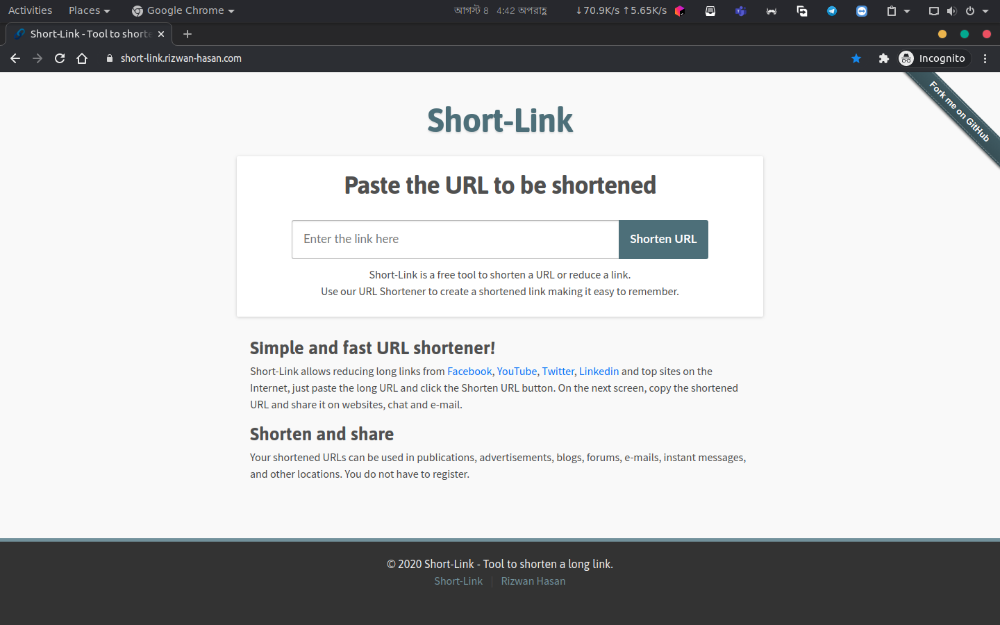

# Flask URL Shortener Application

URL shortening web app built using Flask. It uses the base26 algorithm (derived from base62) for shortening URL, MySQL for database, and also Redis for caching.

## Database Schema

* [Schema SQL file (need to work the app)](MySql-Database-Schema/MySql-Database-Schema.sql)

## Deploying

Just use docker

```bash
docker-compose up
```

## Screenshot


## Contributing
Pull requests are welcome. For major changes, please open an issue first to discuss what you would like to change.

## License
[MIT](LICENSE)
